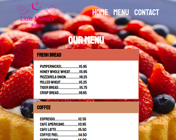

# Restaurant Page

> This is a project created for Microverse



This is a restaurant page, the content of the page is purely embed with javascript.

## Built With

- HTML/CSS
- Javascript
- Webpack

## Live Demo

[Live Demo Link](https://johannrodriguez.github.io/restaurant-page/)


## Getting Started

To get a local copy up and running follow these simple example steps.

### Prerequisites

- npm installed

### Usage

Clone the repo:
```
git clone git@github.com:JohannRodriguez/restaurant-page.git
```
Inside the root folder of the project, install the node packages:
```
npm install
```
Go to the root folder and run the npm build script:
```
npm run build
```
Then use: 
```
npm run dev
```

## Author

👤 **Johann Rodriguez**

- Github: [@JohannRodriguez](https://github.com/JohannRodriguez)
- Twitter: [@BSapce](https://https://twitter.com/BSapce)
- Linkedin: [Johann Rodríguez](https://www.linkedin.com/in/johann-alonso-rodr%C3%ADguez-v%C3%A1zquez-25b07719a/)

## 🤝 Contributing

Contributions, issues, and feature requests are welcome!

Feel free to check the [issues page](https://github.com/JohannRodriguez/restaurant-page/issues).

## Show your support

Give a ⭐️ if you like this project!

## 📝 License

This project is [MIT](lic.url) licensed.
